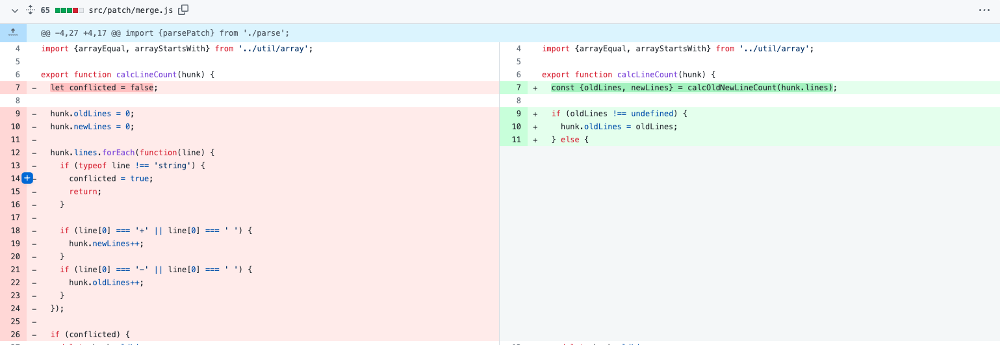
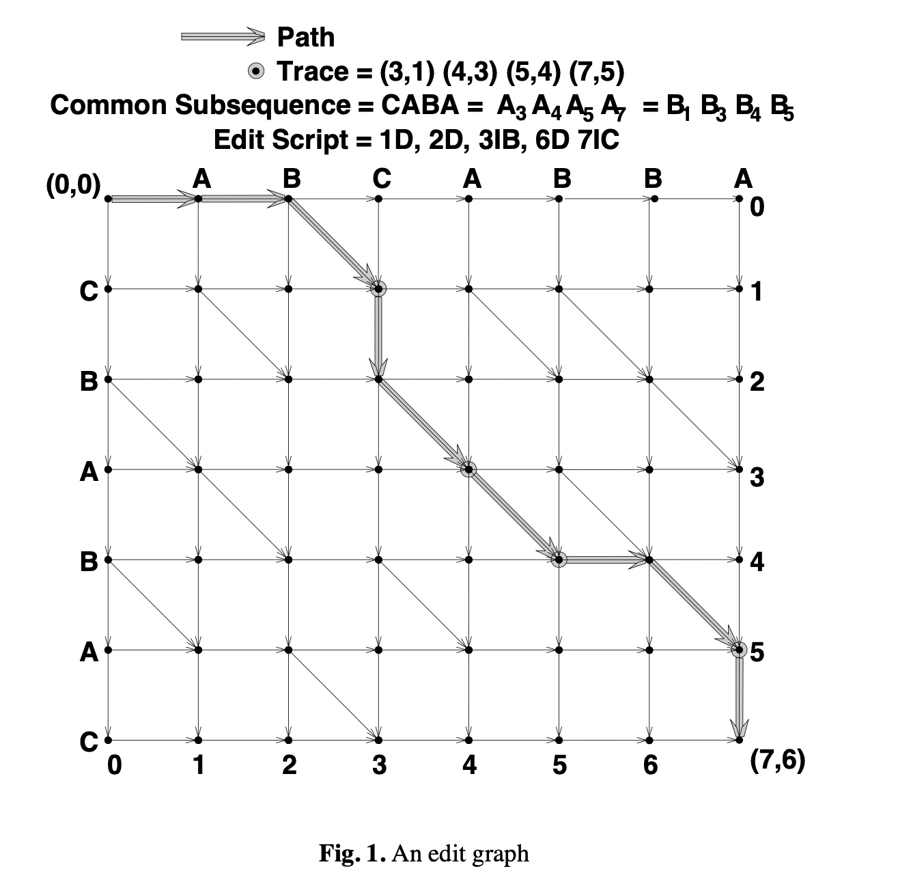
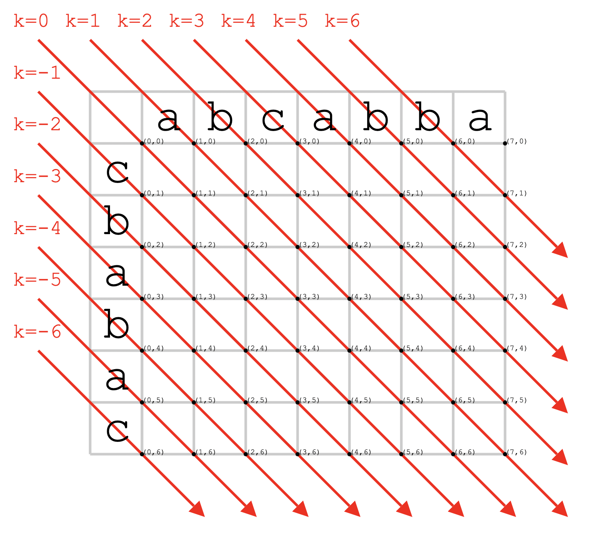
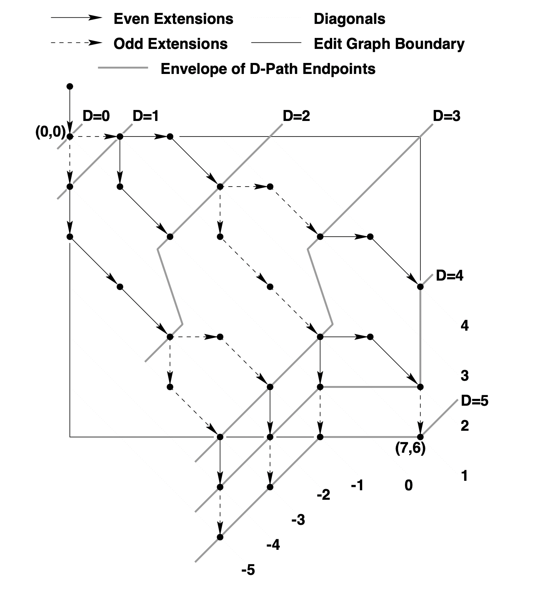

# Diff

本工具提供了基于Myers算法的文本比对功能。

什么是 diff：最能体现 diff 的就是在 git 中，如下图在 Github 上查看代码版本之间的差异。



## 演示地址


## 项目结构

```sh
├── README.md              # README
├── assets                 # 资源文件
│   └── imgs
├── commitlint.config.cjs  # commitlint 配置
├── example                # 样例
├── dist                   # 打包后目录
│   └── index.js
├── install-husky.sh       # 初始化 husky 配置
├── package.json           # package.json
├── .eslintrc.cjs          # eslint 配置
├── .eslintignore          # ingore eslint
├── .gitignore             # ignore git
├── scripts                # 脚本目录
│   └── build.sh
├── src                    # src 源文件
│   ├── base.js            # 基础算法
│   ├── character.js       # 字符 diff
│   ├── index.js
│   ├── line.js            # 行 diff
│   └── word.js            # 单词 diff
├── stylelint.config.cjs   # stylelint 配置
├── rollup.config.js       # rollup 配置
├── .babelrc               # babel 配置
├── test                   # 单测
└── yarn.lock
```

## Usage

```js
import {characterDiff, wordDiff, lineDiff} from 'diff';

characterDiff.diff('booopsssssa', 'oopsssssabb')
// 输出 diff 结果
[
  {value: 'b', option: 'remove'},
  {value: 'oo', option: 'equal'},
  {value: 'o', option: 'remove'},
  {value: 'psssssa', option: 'equal'},
  {value: 'bb', option: 'add'}
]
```

## API

* `characterDiff.diff(oldStr, newStr[, options])`：返回两个文本的 diff 结果，逐个字符比较。

 Options

| 名称         | 可选值       | 默认    | 备注                                     |
| ------------ | ------------ | ------- | ---------------------------------------- |
| `ignoreCase` | `true/false` | `false` | 进行字符比较时是否忽略大小写，默认不忽略 |

* `wordDiff.diff(oldStr, newStr[, options])`：返回两个文本的 diff 结果，逐个单词比较。

Options

| 名称          | 可选值       | 默认    | 备注                                       |
| ------------- | ------------ | ------- | ------------------------------------------ |
| `ignoreCase`  | `true/false` | `false` | 进行字符比较时是否忽略大小写，默认不忽略   |
| `ignoreSpace` | `true/false` | `false` | 进行字符比较时是否忽略空格差异，默认不忽略 |

* `lineDiff.diff(oldStr, newStr[, options])`：返回两个文本的 diff 结果，逐行比较。

Options

| 名称          | 可选值       | 默认    | 备注                                       |
| ------------- | ------------ | ------- | ------------------------------------------ |
| `ignoreCase`  | `true/false` | `false` | 进行字符比较时是否忽略大小写，默认不忽略   |
| `ignoreSpace` | `true/false` | `false` | 进行字符比较时是否忽略空格差异，默认不忽略 |

# 算法原理

我们如何判断两份代码文件的差异呢？本质上这其实是**字符串的比较**，我们不禁会想起算法中的**LCS问题（最长公共子序列）**和**SES问题（编辑距离）**。

* LCS 问题：输入字符串 `abcde` 和 `ace`，返回结果`3`，因为最长公共子序列是 `ace`
* SES 问题：输入字符串 `horse` 和 `ros`，返回结果`3`，因为从 `horse` 转换为 `ros`，最少需要经历以下步骤：
  * horse -> rorse (将 'h' 替换为 'r')
  * rorse -> rose (删除 'r')
  * rose -> ros (删除 'e')

这两种问题都可以基于 DP 算法来解决，时间复杂度为 `O(MN)`，M 和 N 分别为两个字符串的长度，这个时间复杂度对于大量的数据而言速度是偏慢的。

所以下面介绍下由 Eugene W.*Myers* 在 1986 年发表的 **An O(ND) Difference Algorithm and Its Variations**，是一个能在大部分情况产生最短的直观的 diff 的一个算法。

## Myers 算法

论文中提出了 `edit graph` 的概念，例如比较两个字符串的差异，则把原字符串放在 x 轴上：`ABCABBA`，新字符串放在 y 轴上：`CBABAC`。



我们需要找到从左上角到右下角的一条路径，其中：

* 向右走：原字符串中删除一个字符。
* 向下走：原字符串中新增一个字符。
* 对角线：原字符串和新字符串当前字符相同，不做处理。

举个例子：若路径为 `(0, 0) => (7, 0) => (7, 6)`，则代表原字符串把字符逐个都删除，再逐个增加新字符串的字符，这样也会完成原字符串到新字符串的转换。

再比如，我们选择这样一条路径：

1. (0, 0) -> (1, 0)
2. (1, 0) -> (2, 0) -> (3, 1)
3. (3, 1) -> (3, 2) -> (4, 3) -> (5, 4)
4. (5, 4) -> (6, 4) -> (7, 5)
5. (7, 5) -> (7, 6)

这条路径代表的 diff 如下：

```text
- A
- B
  C
+ B
  A
  B
- B
  A
+ C
```

到这里其实就是最经典的**编辑距离问题**，那么我们接着看作者是如何处理的，首先介绍几个概念：

* D-path：横向边纵向边之和为d的路径，走对角线不计入。
* k：定义编辑图中 x - y = k，比如（3, 2）点所在的 k = 3 - 2，即 k = 1。

### 两个定理

* 定理1：一条 d-path 路径的终点肯定落在 [-d, -d+2, ..., d-2, d]
  * 比如 2-path 的路径终点肯定落在 [-2, 0, 2] 上
  * 比如 3-path 的路径终点肯定落在 [-3, -1, 1, 3] 上

* 定理2：d-path 的终点若为 k 值，一定是如下两种情况中的一种产生的
  * 终点是由 k-1 经过右移操作（字符删减）再经过一个足够长的（可能是0）的斜边后到达的。
  * 终点是由 k+1 经过下移操作（字符增加）再经过一个足够长的（可能是0）的斜边后到达的。

关于定理的证明，这里就不再细说了，下图是关于 k 值的几何展现。



在同一 k 值线上，x 值越大则距离终点越近；并且由定理2，为了在步数为 d 时到达 `k值` 为 `k` 的线的话，在步数为 `d-1`时可能在 `k值` 为 `k+1` 或 `k-1`的线上。

若原字符串长度为M，新字符串长度为N，最优的步数一定不会比M+N更差，所以d的上限是 `M+N`。

```js
// 详见 src/base.js 中 execEditPath 方法
for (let d = 0; d <= M + N; d++)
{
    for (let k = -d; k <= d; k += 2)
    {
        // find a max-x point in current k line
        // it depends on max-x point in k-1 line & k+1 line
    }
}
```

我们从坐标 `(0, 0)` 开始，此时，`d=0`，`k=0`，然后逐步增加 `d`，计算每个 `k` 值下对应的最优坐标。

因为每一步要么向右（x + 1），要么向下（y + 1），对角线不影响路径长度，所以，当 d=1 时，k 只可能有两个取值，要么是 `1`，要么是 `-1`。

* 当 `d=1`，`k=1` 时，最优坐标是 `(1, 0)`。

* 当 `d=1`，`k=-1` 时，最优坐标是 `(0, 1)`。

因为 d=1 时，k 要么是 1，要么是 -1，当 d=2 时，表示在 d=1 的基础上再走一步，k 只有三个可能的取值，分别是 `-2`，`0`，`2`。

* 当 `d=2`，`k=-2` 时，最优坐标是 `(2, 4)`。

* 当 `d=2`，`k=0` 时，最优坐标是 `(2, 2)`。

* 当 `d=2`，`k=2` 时，最优坐标是 `(3, 1)`。

以此类推，直到我们找到一个 `d` 和 `k` 值，达到最终的目标坐标 `(7, 6)`。如下图展示了 d 为 0 ~ 5 时的最优坐标。



## 参考资料

* [myersdiff](http://www.xmailserver.org/diff2.pdf)
* [jsdiff](https://github.com/kpdecker/jsdiff)

